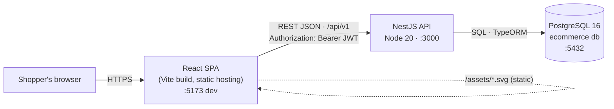
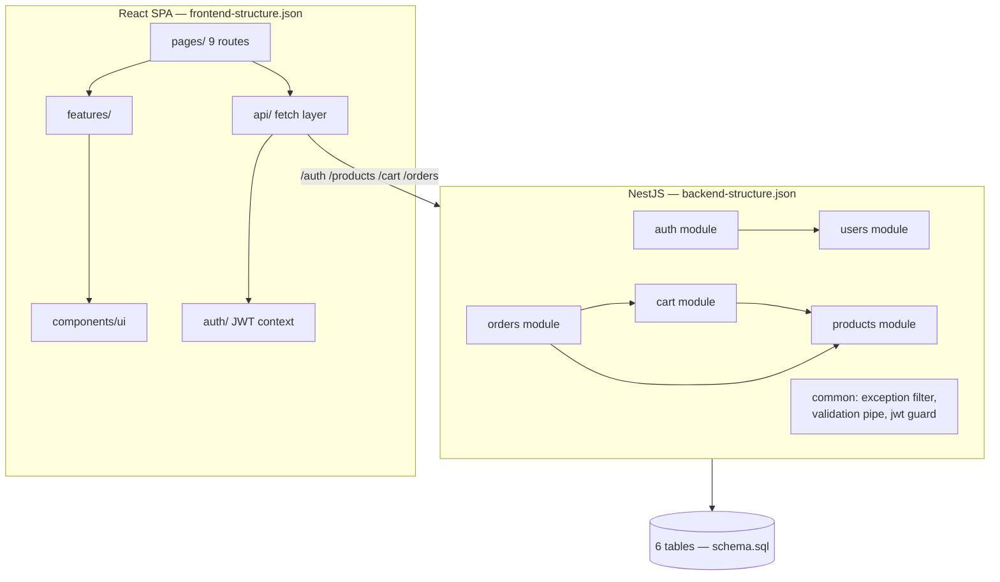
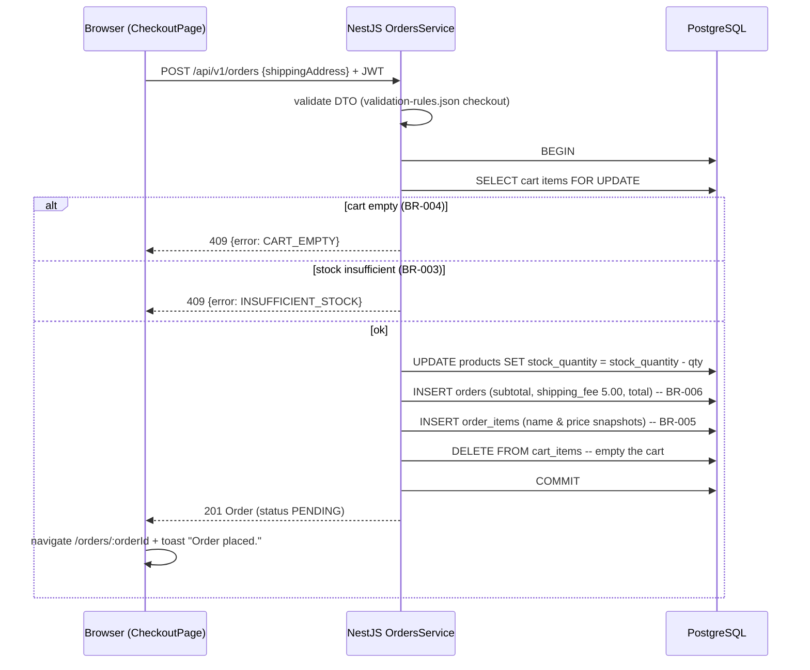
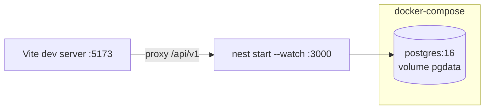

# architecture.md — design-pack artifact E3 (owner: M4 — Standards & Assembly)

System architecture for the e-commerce shop. Stack is fixed (E1): React 18 +
TypeScript + Vite + Tailwind · Node 20 + NestJS REST · PostgreSQL 16 · JWT.

---

## 1 · System context



- The SPA is fully static after build; all data flows through the REST API
  described in openapi.yaml (D2).
- The API is stateless (NFR-001 JWTs carry the session); horizontal scaling
  needs no session store.
- Assets (logo/icons/product images) are served statically by the frontend
  host from `public/assets/` (see assets-manifest.md).

## 2 · Module view



## 3 · Key sequence — checkout (REQ-009; BR-003/004/005/006)



## 4 · Auth flow (REQ-001/002/012, NFR-001/002)

```mermaid
sequenceDiagram
    participant B as Browser
    participant A as NestJS AuthController
    participant P as PostgreSQL

    B->>A: POST /auth/register {fullName, email, password}
    A->>P: INSERT users (bcrypt cost 12) + INSERT carts
    A-->>B: 201 {accessToken (exp 3600s), user}
    Note over B: JWT stored; sent as Authorization: Bearer on every protected call
    B->>A: GET /cart (Bearer)
    A-->>B: 200 Cart
    Note over B: expiry/invalid token → 401 UNAUTHORIZED → client discards JWT,<br/>redirects /login?next=… (state-transitions.md §3)
```

## 5 · Data model (schema.sql is authoritative)

```mermaid
erDiagram
    users ||--o| carts : "owns (1:1)"
    users ||--o{ orders : places
    carts ||--o{ cart_items : contains
    products ||--o{ cart_items : "referenced by"
    products ||--o{ order_items : "referenced by"
    orders ||--o{ order_items : contains

    users { uuid id PK; varchar email UK; varchar password_hash; varchar full_name }
    products { uuid id PK; varchar name; numeric price; int stock_quantity; varchar category; bool is_active }
    carts { uuid id PK; uuid user_id FK }
    cart_items { uuid id PK; uuid cart_id FK; uuid product_id FK; int quantity }
    orders { uuid id PK; uuid user_id FK; varchar order_number UK; order_status status; numeric subtotal; numeric shipping_fee; numeric total }
    order_items { uuid id PK; uuid order_id FK; uuid product_id FK; varchar product_name; numeric unit_price; int quantity }
```

## 6 · Deployment (local/dev reference)



- `docker compose up -d` starts PostgreSQL 16; `schema.sql` initialises it
  (mounted as an init script or run via migration 0001).
- Configuration comes exclusively from `.env` (contract: `.env.example`, E2).
- Production shape: static SPA behind any web server/CDN; API as a single
  container; managed PostgreSQL. Nothing else is required (no cache, no queue).

## 7 · Cross-cutting decisions

| Concern | Decision | Where |
|---------|----------|-------|
| Error shape | Single `{error:{code,message,details[]}}` envelope | openapi.yaml, GlobalExceptionFilter |
| Message text | Defined once, reused verbatim (NFR-007) | validation-rules.json |
| Money | NUMERIC(10,2) USD end-to-end; render with 2dp | schema.sql, SKILL.md §4 |
| IDs | UUIDv4 server-generated | schema.sql |
| Pagination | page/limit + items/total/totalPages envelope, limit ≤ 100 (NFR-004) | openapi.yaml |
| Traceability | REQ/BR/NFR IDs in code comments at implementation sites | SKILL.md §7 |
