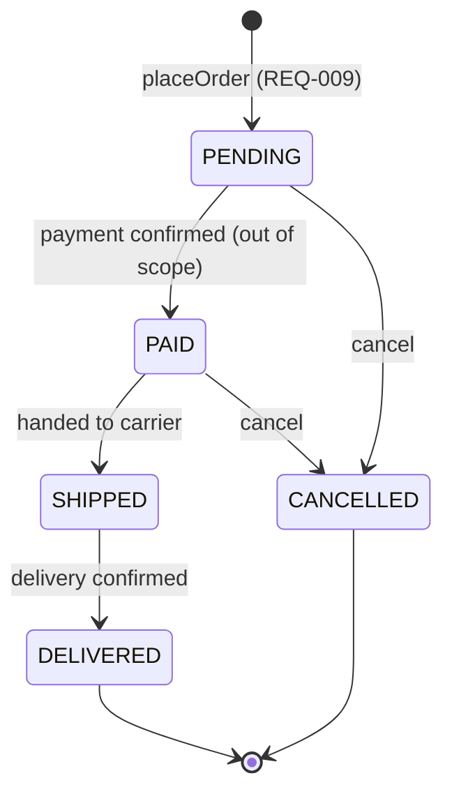
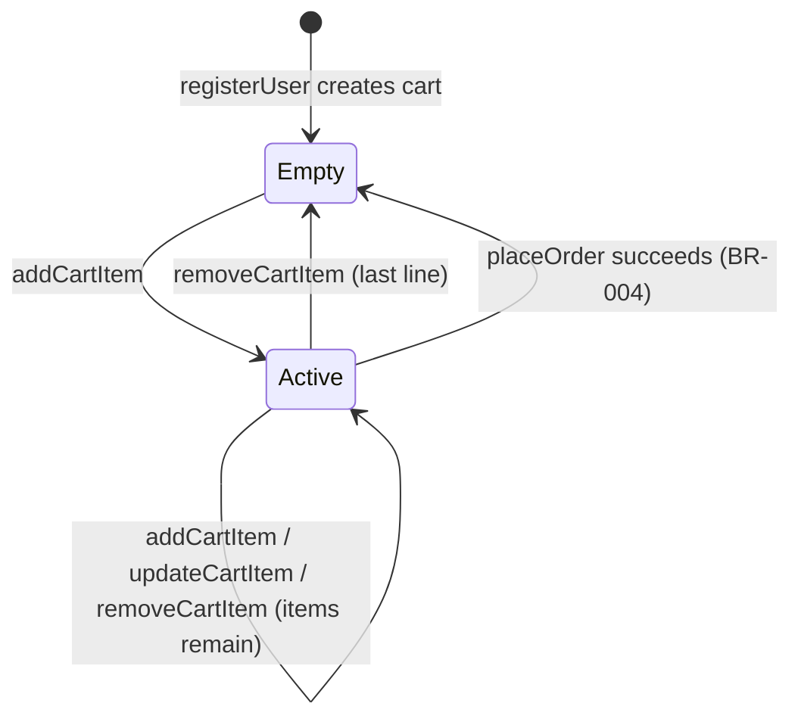
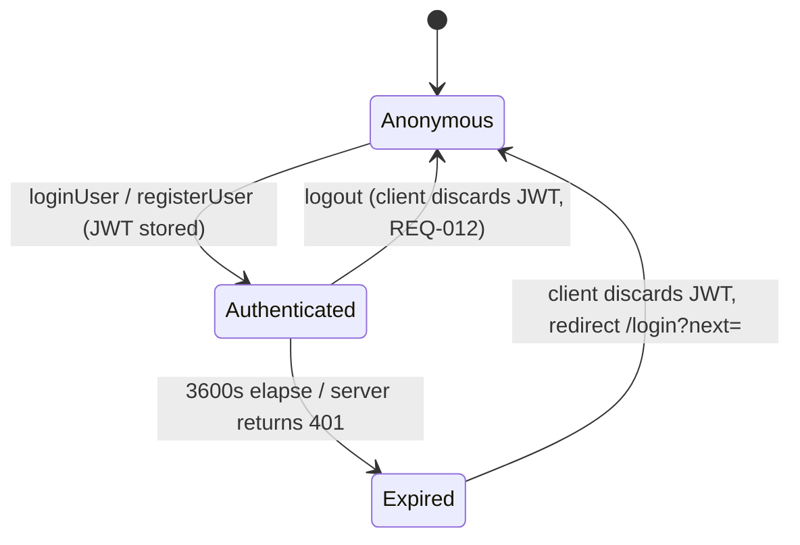

# state-transitions.md — design-pack artifact B3 (owner: M3 — UI & Frontend)

State machines for the e-commerce shop: the Order lifecycle (BR-007), the Cart,
the auth Session, and the async UI states every screen must implement. Status
names are the exact strings of the `order_status` enum in schema.sql and the
`status` field in openapi.yaml.

---

## 1 · Order lifecycle (BR-007)

### Transition table

| From | To | Trigger | Actor | Notes |
|------|----|---------|-------|-------|
| — | PENDING | `placeOrder` succeeds | User (checkout) | The only entry point. Stock decremented, cart emptied (BR-004), prices snapshotted (BR-005). |
| PENDING | PAID | Payment confirmed | System (out-of-scope payment process) | No payment integration is designed; Testing may drive this transition directly in the DB. |
| PENDING | CANCELLED | Cancel request | Support/system (no UI in scope) | Stock is restored. |
| PAID | SHIPPED | Handed to carrier | Fulfilment (out of scope) | Point of no return for cancellation. |
| PAID | CANCELLED | Cancel request | Support/system | Stock is restored. |
| SHIPPED | DELIVERED | Delivery confirmed | Carrier webhook / manual | Terminal. |

**Everything else is forbidden.** In particular: no transition out of
DELIVERED or CANCELLED, no skipping PENDING, no CANCELLED after SHIPPED.
The service must reject forbidden transitions; there is no user-facing
cancel/ship UI in scope — the shop UI only *displays* status.

### Status → Badge (mockup.html component gallery, tokens.json `statusBadge`)

| Status | Token | Hex |
|--------|-------|-----|
| PENDING | warning | #D97706 |
| PAID | primary | #2563EB |
| SHIPPED | primary | #2563EB |
| DELIVERED | success | #16A34A |
| CANCELLED | error | #C0392B |

Badge style: status colour text on a 12%-opacity tint of the same colour,
radius `pill`, font `small`.

---

## 2 · Cart states

- **Empty** — `items: []`, `itemCount: 0`. Cart screen shows the empty state;
  the Checkout button is disabled; header badge hidden (or 0).
- **Active** — ≥ 1 line. Every mutation endpoint returns the full updated cart;
  the UI re-renders from the response, never recomputes totals locally.
- The cart entity itself is never deleted (one per user, `carts_user_unique`).

---

## 3 · Auth session states (NFR-001, REQ-012)

- **Anonymous** — header shows Login/Register; `auth: true` routes redirect to
  `/login?next=<path>`.
- **Authenticated** — header shows cart badge, My Orders, Log out.
- **Expired** — detected only via a 401 `UNAUTHORIZED` response; the client
  discards the token, shows the toast "Authentication required. Please log
  in.", and redirects preserving `next`.

---

## 4 · Async UI states (every data-driven screen)

Each screen implements exactly these four render states:

| State | Render | Component |
|-------|--------|-----------|
| loading | Centered Spinner (spinner keyframes, 800 ms rotation); submit buttons show inline spinner + disabled | Spinner / Button loading |
| success | The screen's content | — |
| empty | Icon + one-line explanation + call-to-action button | Empty state (Card) |
| error | Error banner with the envelope's `error.message`, plus a Retry button for GET failures | Banner (error token) |

Screen-specific instances:

| Screen | empty | error (typical) |
|--------|-------|-----------------|
| Products | "No products match your search." + Clear filters | banner + Retry |
| Cart | "Your cart is empty." + Browse products | banner + Retry |
| My Orders | "You haven't placed any orders yet." + Browse products | banner + Retry |
| Order Confirmation | — (an order always has lines) | "Order not found." full-page state |
| Product Details | — | "Product not found." full-page state |

Mutation feedback:

- Success → Toast (success token), auto-dismiss 3000 ms: "Added to cart.",
  "Cart updated.", "Item removed.", "Order placed."
- Business-rule failure (409) → error Toast or inline banner with the exact
  message from validation-rules.json (e.g. "Only 3 left in stock.").
- Field validation (400) → inline error text under the field, error border,
  message verbatim from validation-rules.json (NFR-007).
