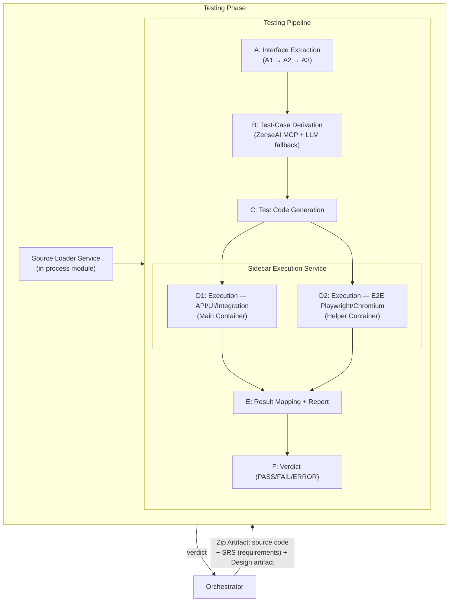
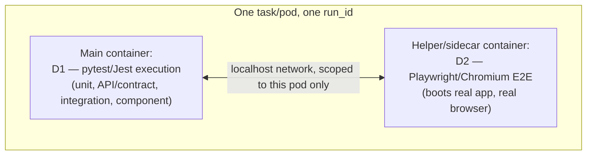
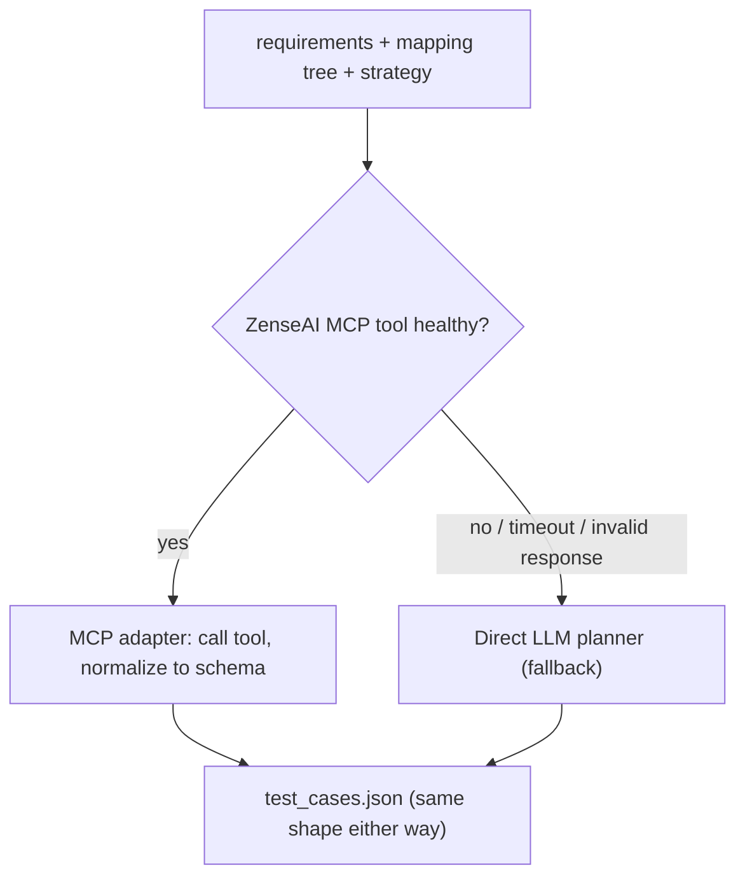

# Testing Agent — Implementation Reference (v5: Aligned to Architecture Diagram)

Supersedes all prior versions. This update aligns the plan with the provided architecture diagram: confirms the sidecar execution model (previously an open decision), splits Result Mapping (E) from Verdict (F) as distinct stages, retains the A1→A2→A3 Interface Extraction sub-pipeline from the reference doc, and flags two label discrepancies in the diagram for explicit confirmation rather than silently changing a core design principle.

---

## 0. ⚠️ Two discrepancies to confirm before this is final

The diagram labels two steps **"(LLM)"** that the reference doc explicitly designates as deterministic. This document keeps them **deterministic**, per the reference doc's repeated principle ("Steps C, D, and E are pure deterministic code" / "A2 — Deterministic (graph assembly)"). Flagging rather than silently overriding:

| Step | Diagram label | Reference doc | This document assumes |
|---|---|---|---|
| A2 — Codebase Mapping Tree | "(LLM)" | Deterministic (graph assembly from chunks) | **Deterministic** — confirm if this is intentional drift or a diagram labeling error |
| C — Test Code Generation | "(LLM)" | Deterministic (templates, no LLM, for reproducibility) | **Deterministic** — confirm; if genuinely LLM-driven now, this changes §7's trust model (expected values would need re-verifying they still trace only to requirements, not to LLM-generated test code) |

If these are intentional changes, they need their own write-up (why templates alone weren't sufficient, what guardrails replace the "deterministic and reviewable" property) — not a silent label change.

---

## 1. What this is (and the principles behind it)

The Testing Phase is **one phase**, containing two components under the orchestrator's single call:

1. **Source Loader Service** — an in-process module (not a separate networked service, not the orchestrator's job) that turns the zip artifact into clean, inline source code before the pipeline runs.
2. **Testing Pipeline** — a **linear pipeline of six stages (A → B → C → D1/D2 → E → F)**, where **A** is itself a three-step sub-pipeline (A1 → A2 → A3).



**Note on the zip artifact's contents (per the diagram):** the orchestrator's payload bundles source code, SRS (requirements), and the design artifact together — the Source Loader Service is responsible for extracting the source code portion into clean `source_code[]`; requirements and design pass through to the pipeline as structured data alongside it, not as part of what needs zip-extraction. Confirm this packaging is genuinely how the orchestrator delivers these three, since earlier discussion assumed requirements/design arrive as already-structured JSON/text independent of the zip.

Design principles, unchanged from prior versions:

- **One phase, not many agents.** All pipeline stages are functions, not sub-agents. No sub-orchestrator inside the phase.
- **LLM concentrated in the planning steps.** A3 (test-case strategy) and B (test-case derivation) are the two LLM-driven steps. A1 is deterministic with an LLM fallback only when a language has no tree-sitter grammar. A2, C, D1, D2, E are deterministic. (See §0 for the two labels to confirm.)
- **Stateless.** The phase never holds retry state; `attempt` is supplied by the orchestrator.
- **Expected values come from requirements, never from the code.** The mapping tree / interface is read only for call shape.
- **Zip handling is in-process, not a separate service, not the orchestrator's job.** The Source Loader Service is a module inside the same deployment as the pipeline.
- **Verdict-based control.** `PASS | FAIL | ERROR`, distinct from HTTP/transport status.
- **E2E is real but narrow.** Playwright, Chromium only, runs in a separate sidecar/helper container — confirmed by the diagram as the resolved execution model (see §5).

---

## 2. Settled architecture decisions (updated)

| Decision | Choice | Rationale |
|---|---|---|
| Components in the Testing phase | **Source Loader Service (in-process module) + Testing Pipeline (one service)** | Diagram confirms both live inside one "Testing Phase" boundary |
| Pipeline stage count | **6 stages (A–F)**, A expands into 3 sub-steps (A1–A3) | Matches reference doc + diagram exactly |
| Sub-orchestrator inside the phase | **No** | Fixed linear order |
| LLM usage | **A3 + B** (+ A1 fallback) | Concentrate reasoning — see §0 for two labels needing confirmation |
| **Execution model — NOW RESOLVED** | **Sidecar pattern.** D1 (API/UI-component/Integration) runs in the **main container**; D2 (E2E, Playwright/Chromium) runs in a **helper/sidecar container** alongside it | This was an open, blocking decision in prior versions (§9's "pick one — blocks Phase 3"); the diagram resolves it explicitly |
| Zip handling | **In-process Source Loader Service module**, inside the Testing Phase, not the orchestrator, not a separate networked service | No network hop, no second contract, one deployment |
| Result mapping vs. verdict | **Split into two stages: E (mapping + report) then F (verdict computation)** | Diagram separates these; previously combined under one "Step E" |
| Reference tooling naming | **"ZenseAI"** — explicit name for the reference repo/MCP tool adapted for A3 and B | Matches diagram's explicit labeling; previously referred to generically as "the reference repo" / "zenseai-hub" |
| Control signal | **`verdict` field**, not HTTP status | Unchanged |

---

## 3. What the Sidecar Execution Service resolves

The diagram's right-hand annotation defines this explicitly: *"a design pattern used in microservices architecture where a helper container runs alongside the main application."* Concretely:



- **D1 (main container):** runs everything that doesn't need a live browser — unit tests, API/contract tests (in-process `TestClient`/Supertest), integration tests, and React component tests (jsdom). This is the "API/UI/Integration test" box in the diagram — **"UI" here means component-level (jsdom), not real-browser E2E**, consistent with the reference doc's explicit scope caveat in §8.
- **D2 (helper/sidecar container):** runs only when Step B has produced `e2e_flow` test cases. Boots the real backend + frontend, waits for health checks, launches headless Chromium, runs the generated Playwright specs.
- **Why sidecar, not Docker-in-Docker or plain subprocess:** this was flagged as the recommended-but-unconfirmed option in the reference doc's §9 ("Sidecar execution service (recommended)"). The diagram formalizes it as the actual decision — main and helper containers share a pod/task-scoped network, so D1↔D2 coordination (if any) and D2's own internal app↔browser traffic stay contained to that pod, without opening the sandbox to the wider network.
- **What this resolves from the open-risks list:** the reference doc's 🔴 "Sandbox execution model — blocks Phase 3; needs infra/security sign-off" is now **answered** (sidecar), though the sign-off itself (§9's isolation/limits requirements: timeouts, resource caps, network scoping) still needs to happen — the pattern is chosen, the concrete configuration is not yet.

---

## 4. Interface Extraction (Step A) — unchanged from the reference doc, confirmed by diagram

```
A1  Codebase chunking       →   A2  Codebase mapping tree (JSON)   →   A3  Test-case strategy planner
    (symbol-level, tree-sitter)      (call/dependency graph — deterministic*)   (ZenseAI-adapted, LLM)
```
*flagged in §0 — diagram labels this "(LLM)"; kept deterministic here pending confirmation.

- **A1 — Codebase chunking.** Tree-sitter (Java/Python/JS/TS), symbol-level chunks (class/method/function/interface), not file-blobs. LLM fallback (`llm_fallback.py`) only when no grammar exists for a language. Deliberately **not** the RAG-style file-summarization chunker used elsewhere in the ZenseAI reference repo — that's tuned for retrieval-by-query and destroys the call-graph structure A2 needs.
- **A2 — Mapping tree.** Assembles chunks into a `symbol_id`-keyed graph with `calls`/`called_by` edges.
- **A3 — Test-case strategy planner.** Adapted from ZenseAI's `test_strategy_agent.py`. Given the mapping tree + requirements, produces `test_strategy.json`: impacted files/symbols, test type (Unit/Integration/E2E/…), priority, coverage gaps, historical risks. Decides **what to test and where**; Step B then derives the concrete cases.

**Critical rule, unchanged:** A tells B *how to call* the code and *what areas need tests*. It must never be used to derive *what the code should return* — expected values come from requirements only.

---

## 5. Step B — Test-Case Derivation (ZenseAI MCP + LLM fallback)

Takes A3's strategy (what to test, priorities, coverage gaps) plus the requirements, derives concrete test cases per requirement. Emits `test_cases.json` before any code is generated.



Direct-LLM path built first, remains the permanent fallback — the ZenseAI MCP path is additive, never a hard dependency, per the reference doc's original design.

---

## 6. Step C — Test Code Generation

**Per §0: kept deterministic (templates), per the reference doc's explicit reasoning — "No LLM; deterministic so output is reproducible and reviewable."** Confirm with the team whether the diagram's "(LLM)" label reflects an intentional change; if so, this section and §7's trust-model rules need a rewrite, since "expected values trace to requirements, not to generated code" currently relies on Step C being a faithful, non-creative translation of `test_cases.json`.

Routed by `tech_stack` (§9 polyglot table), functional cases → `codegen/<runtime>.py`; `e2e_flow` cases → `codegen/e2e_playwright.py`.

---

## 7. D1 / D2 — Execution (sidecar pattern, confirmed)

| | D1 (main container) | D2 (helper/sidecar container) |
|---|---|---|
| Runs | Unit, API/contract (in-process), integration, component (jsdom) | E2E (Playwright, Chromium only) |
| Needs a live app? | No — in-process calls (`TestClient`/Supertest) | Yes — boots real backend + frontend, health-check gated |
| Network | Fully disabled | Loosened to pod-internal/localhost only, still no outbound internet |
| Runs when | Always | Only if Step B produced `e2e_flow` cases |
| Output | `raw_results.json` | `raw_e2e_results.json` |

Both feed into Step E.

---

## 8. Step E — Result Mapping + Report (now separate from Verdict)

Joins `raw_results.json` and `raw_e2e_results.json` back to `test_cases.json` by id/req_id, attaches `likely_cause` per failing requirement, builds the human-readable Markdown report. **Does not itself finalize the top-level `verdict` field** — that's Step F, per the diagram's explicit split.

---

## 9. Step F — Verdict (PASS / FAIL / ERROR)

Takes E's per-requirement results and computes the single top-level `verdict`:
- `PASS` only if both `failed_requirements` and `untested_requirements` are empty.
- `FAIL` otherwise, carrying `likely_cause` (`code | test | infra | unknown`) per failing requirement.
- `ERROR` if no verdict could be produced at all (source-loading failure, sandbox failure, bad input) — this is checked before the pipeline even reaches A, per the Source Loader Service's own failure path.

This split (E vs. F) doesn't change the external contract shape — the orchestrator still receives one JSON object with a `verdict` field — it's an internal pipeline-stage clarification, useful for testing E and F independently (e.g. golden-testing the mapping logic in E separately from the pass/fail threshold logic in F).

---

## 10. Polyglot routing (unchanged)

| Runtime | Generator | Runner (D1) | In-memory DB |
|---|---|---|---|
| `python` | `codegen/python.py` | `pytest --json-report` (TestClient for API) | SQLite `:memory:`; `mongomock` |
| `node`/`express` | `codegen/node.py` | `jest --json` (+ Supertest) | `mongodb-memory-server`; `sql.js` |
| `react` (component) | `codegen/react.py` | `jest --json` (RTL, jsdom) | usually none |
| `e2e` (any stack, D2) | `codegen/e2e_playwright.py` | `playwright test` (Chromium only) | backend's own harness, booted for real |

---

## 11. Build phases (updated)

| Phase | Focus | Key deliverable | Depends on |
|---|---|---|---|
| SL | Source Loader Service (in-process module) | `source_loader.py`, malicious-zip fixtures | — |
| 0 | Scaffold | Empty running service, `/health`, `/ready`, `main.py` calling `source_loader` then `pipeline` | — |
| 1 | Contract | Frozen I/O schema + fixtures (incl. `e2e_flow` case) | — |
| 2 | Planning (A1→A2→A3, then B, direct LLM) | `chunks[]`, `mapping_tree.json`, `test_strategy.json`, `test_cases.json` | Phase 1 |
| 2b | ZenseAI MCP integration | MCP adapter, router, fallback for B (and optionally A3) | Phase 2 |
| 3 | Sidecar infra — main container (D1) | Functional execution, `raw_results.json` | Phase 2; sidecar pattern confirmed (§3) |
| 3b | Sidecar infra — helper container (D2) | Playwright/Chromium execution, `raw_e2e_results.json` | Phase 3 |
| 4 | Validation (E then F) | Mapping/report, then verdict computation | Phase 3b |
| 5 | Extra layers | Static analysis/security scan | Phase 4 |
| 6 | Polyglot | Node + React support (D1 and D2 both) | Phase 4 |
| 7 | Integration | Live orchestrator loop, requirement-ID propagation, sidecar pod networking verified end-to-end | Phase 6 |

---

## 12. Open risks (updated)

- 🔴 **Confirm A2/C "(LLM)" labels (§0)** — new, blocking until resolved; changes trust-model guarantees if either is genuinely LLM-driven.
- 🔴 **Requirement-ID propagation** — unchanged, verify in Phase 7 with real upstream output.
- 🟢 **~~Sandbox execution model~~ — RESOLVED.** Sidecar pattern confirmed by diagram; remaining work is the concrete timeout/resource/network-scoping configuration for the pod, not the pattern choice itself.
- 🔴 **ZenseAI MCP external dependency (Step B, possibly A3)** — needs fallback-on-failure, response validation, clarity on data leaving your infrastructure.
- 🟠 **Zip artifact bundling (source + SRS + design together)** — confirm this matches how the orchestrator actually delivers these three; if requirements/design arrive separately from the zip (as previously discussed), the diagram's single "Zip Artifact" box needs a footnote distinguishing what's zipped vs. what's passed as structured data alongside it.
- 🟠 **E2E network-policy exception (D2)** — pod-internal network scoping for the sidecar still needs its own explicit sign-off, distinct from D1's fully-disabled network.
- 🟠 **Chromium-only coverage gap, selector fragility, dev-agent output contract, verdict vs. transport status** — unchanged from prior versions.
- 🟡 **LLM nondeterminism, adjudication accuracy, E2E execution time budget** — unchanged from prior versions.

---

## Summary

The diagram confirms the sidecar execution pattern as the resolved answer to a previously open, blocking decision — D1 (functional/component tests) in the main container, D2 (Playwright/Chromium E2E) in a helper container, sharing a pod-scoped network. It also formalizes "ZenseAI" as the named reference tool behind A3 and B, and splits the old combined "Step E" into **E (mapping + report)** and **F (verdict)** as distinct stages. Two labels in the diagram — A2 and C marked "(LLM)" — contradict the reference doc's explicit deterministic-by-design principle for those steps; this document keeps them deterministic pending confirmation, since silently making either LLM-driven would change what the test-generation trust model actually guarantees.
