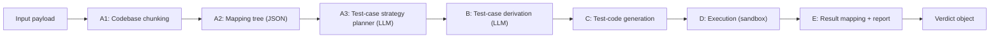
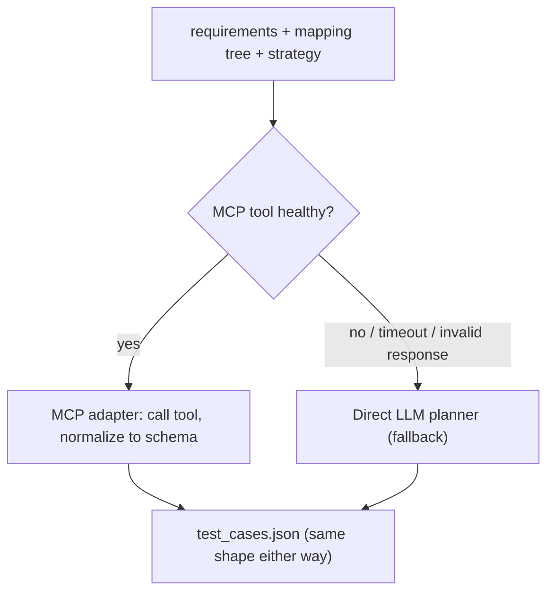
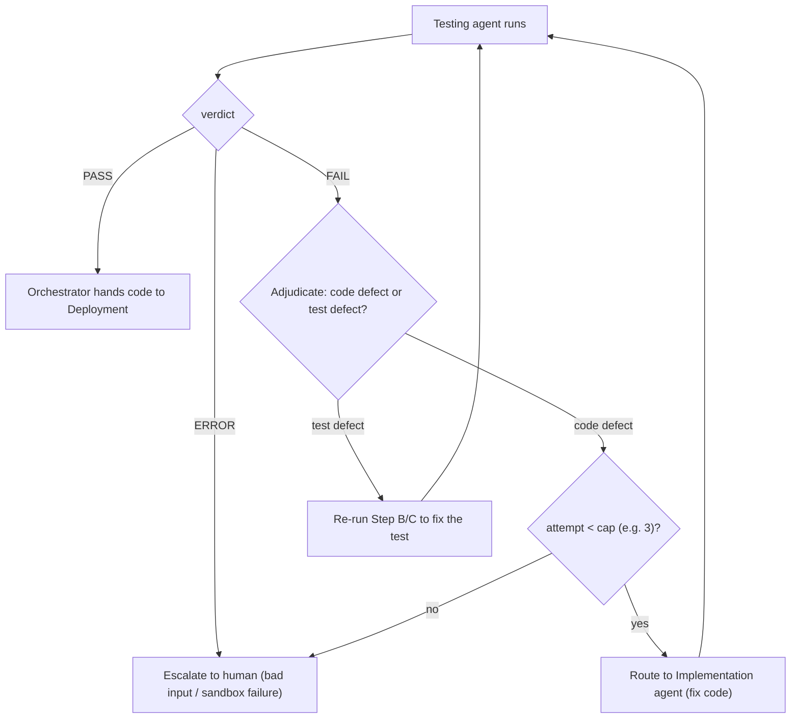
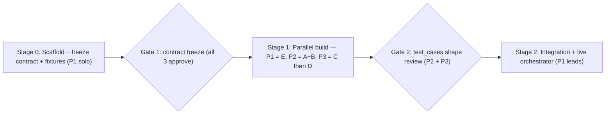

# Testing Agent — Implementation Reference

A single, detailed reference for building the Testing phase agent of the multi-agent SDLC system. It consolidates the frozen I/O contract, the settled architecture, per-module detail, the quality/adjudication rules, the build sequence, and the three-person workflow.

---

## 1. What this agent is (and the principles behind it)

The Testing Agent is **one agent** implemented as a **linear pipeline of five deterministic-first modules (A → B → C → D → E)**. It receives a project's requirements, design, and already-extracted source code from the orchestrator, generates and runs tests, and returns a structured verdict the orchestrator branches on.

Design principles that every implementation decision must respect:

- **One agent, not many.** The five modules are functions in a pipeline, not sub-agents. There is **no second orchestrator inside this phase** — the flow is a fixed straight line, so there is nothing to orchestrate. The only orchestrator in the whole system is the top-level one that routes *between* phases.
- **LLM concentrated in the planning steps.** Test-case reasoning is LLM-driven in two places: Step A3 (test-case strategy) and Step B (test-case derivation). Steps A1 (chunking) and A2 (mapping tree) are deterministic tree-sitter/AST passes with an LLM *fallback* only when a language has no grammar. Steps C, D, and E are pure deterministic code. Fewer LLM calls = cheaper, more reliable, easier to test.
- **Stateless.** The agent never holds retry state. The `attempt` counter is supplied and owned by the orchestrator upstream.
- **Expected values come from requirements, never from the code.** The interface / mapping tree is read only to learn *how to call* the code; *what to expect* is derived from requirements + design. (See §4 Step A and §7.)
- **The agent never touches a zip.** The orchestrator validates and extracts; this agent always receives inline `source_code[]`.
- **Verdict-based control.** Output carries `PASS | FAIL | ERROR`, distinct from HTTP/transport status. A successful call can legitimately return `FAIL`.

---

## 2. Settled architecture decisions

These are locked; the rest of the document assumes them.

| Decision | Choice | Rationale |
|---|---|---|
| Agent count in this phase | **1 agent, 5 modules** | Linear flow, no coordination to justify sub-agents |
| Sub-orchestrator inside Testing | **No** | Order is fixed (A→B→C→D→E); an orchestrator would only hardcode a straight line |
| LLM usage | **Steps A3 + B** (+ A1 fallback) | Concentrate reasoning; keep A1/A2/C/D/E deterministic |
| Retry / loop control | **Orchestrator (upstream)** | Keeps this agent stateless; one home for coordination |
| Zip handling | **Orchestrator (upstream)** | Zip-slip / zip-bomb validation lives in exactly one place |
| Source code delivery | **Inline, pre-extracted, code-only** | No dev-agent reasoning (prevents bias) |
| Control signal | **`verdict` field**, not HTTP status | Orchestrator branches on business outcome |

---

## 3. Interface contract (frozen)

The orchestrator, **before** calling this agent, must: validate the zip (size cap, path-traversal/zip-slip, file-count/zip-bomb), extract into its own controlled workspace, read each file into `source_code[]` in the exact shape below, and never forward a raw zip reference.

### INPUT (orchestrator → Testing Agent)

```json
{
  "phase": "testing",
  "run_id": "...",
  "attempt": 1,
  "requirements": [
    {"id": "REQ-003", "text": "Age must be 0-120 inclusive",
     "acceptance_criteria": ["reject <0", "reject >120", "accept 0 and 120"]}
  ],
  "design_spec": "...markdown or structured design (optional)...",
  "source_code": [
    {"path": "app/user.py", "language": "python", "content": "..."}
  ],
  "tech_stack": {"runtime": "python", "framework": "fastapi", "db": "sql"}
}
```

### OUTPUT (Testing Agent → orchestrator)

```json
{
  "phase": "testing",
  "run_id": "...",
  "verdict": "PASS",
  "summary": {
    "total_requirements": 12,
    "passed_requirements": ["REQ-001", "REQ-002"],
    "failed_requirements": ["REQ-003"],
    "untested_requirements": []
  },
  "requirement_results": [
    {"req_id": "REQ-003", "status": "FAIL", "tests": ["TC-003-1"],
     "reason": "boundary: value 120 rejected but spec says inclusive",
     "likely_cause": "code"}
  ],
  "artifacts": {
    "test_cases": [ {"id": "TC-003-1", "req_id": "REQ-003", "type": "boundary",
      "input": {"age": 120}, "expected": {"status": "accepted"}} ],
    "raw_results": {"framework": "pytest", "report": {}},
    "report_markdown": "## Test Report ..."
  },
  "meta": {"framework": "pytest", "runtime": "python", "tests_total": 34,
    "tests_failed": 1, "duration_s": 8.2, "schema_version": "1.0"}
}
```

### Contract rules

- **`verdict`** ∈ `PASS | FAIL | ERROR`. This is what the orchestrator branches on.
- **`ERROR`** means the agent could not produce a verdict (bad input, sandbox failure). The orchestrator should escalate/inspect — **not** route to the Implementation agent.
- **Verdict computation:** `PASS` only if **both** `failed_requirements` **and** `untested_requirements` are empty.
- **`attempt`** is supplied by the orchestrator; the agent never increments it.
- **`source_code`** is always inline, pre-extracted, and code-only (no dev-agent reasoning).
- **`likely_cause`** (`code | test | unknown`) is an adjudication hint per failing requirement — see §10.

---

## 4. Internal architecture — the five modules



| Step | Module(s) | Nature | In → Out |
|---|---|---|---|
| A1 — Codebase chunking | `interface_extraction/codebase_chunker.py` (+ `llm_fallback.py`) | Deterministic (tree-sitter AST) + LLM fallback | `source_code[]` → `chunks[]` (symbol-level) |
| A2 — Mapping tree | `interface_extraction/mapping_tree_builder.py` | Deterministic (graph assembly) | `chunks[]` → `mapping_tree.json` |
| A3 — Test-case strategy planner | `interface_extraction/testcase_strategy_planner.py` | LLM (adapted from repo `test_strategy_agent.py`) | `mapping_tree.json` + `requirements[]` → `test_strategy.json` |
| B — Test-case derivation | `testcase_planner.py` + `testcase_planner_mcp_adapter.py` + `testcase_planner_router.py` | LLM (direct or via MCP) | `mapping_tree.json` + `test_strategy.json` + `requirements[]` → `test_cases.json` |
| C — Test-code generation | `codegen/<runtime>.py` | Deterministic (templates) | `test_cases.json` + `tech_stack` → test files |
| D — Execution | `runner/<runtime>.py` | Deterministic (sandboxed subprocess/container) | test files → `raw_results.json` |
| E — Result mapping | `result_mapper.py` + `report_generator.py` | Deterministic map + optional LLM prose | `raw_results.json` + `test_cases.json` → verdict object |

### Step A — Interface Extraction (a three-step sub-pipeline, not a single pass)

Interface Extraction is itself a small phase of **three ordered steps** that together turn raw `source_code[]` into a test strategy the rest of the pipeline builds on. What flows to Step B is the **mapping tree JSON** plus the **test strategy** — not a flat `interface.json`.

```
A1  Codebase chunking       →   A2  Codebase mapping tree (JSON)   →   A3  Test-case strategy planner
    (symbol-level, AST)             (call / dependency graph)              (what to test, priorities)
```

**A1 — Codebase chunking (symbol-level, AST-based).** Parse `source_code[]` with **tree-sitter** (Java / Python / JS / TS) and emit **one chunk per symbol** (class / method / function / interface) — *not* file-level blobs. Chunk boundaries are symbol boundaries, so each chunk becomes a node in A2. Interface extraction and chunking are the *same* parse pass — the signatures pulled from the parse tree are the chunk metadata.

> **Do not** copy the RAG-style chunker used elsewhere in this repo (`codebase_summarizer_agent` → `all-MiniLM-L6-v2` + FAISS, one LLM-summarized document per file). That is tuned for "find files relevant to a query" and deliberately blurs internal structure; it cannot produce clean call-graph edges. Symbol-aligned chunking is what makes A2 and A3 possible. Fallback when tree-sitter has no grammar for a language: `RecursiveCharacterTextSplitter.from_language(...)` (chunk_size ≈ 1500, overlap ≈ 200) — coarser, so the mapping tree gets fuzzier.

Each chunk carries the metadata A2/A3 depend on:

```json
{
  "symbol_id": "com.auth.LoginService#login",
  "filename": "src/auth/LoginService.java",
  "symbol_type": "method",
  "signature": "public Token login(Creds c)",
  "content": "public Token login(Creds c){...}",
  "start_line": 42, "end_line": 71,
  "calls": ["RateLimiter#check", "TokenStore#issue"],
  "is_test": false
}
```

**A2 — Codebase mapping tree (JSON).** Assemble chunks into a graph keyed by `symbol_id`, with `calls` / `called_by` edges — the call/dependency tree. This JSON is the durable artifact of the phase and is passed downstream *alongside* the strategy. A file-blob chunker cannot produce these edges — this is why A1 must be symbol-aligned.

**A3 — Test-case strategy planner.** Adapted from this repo's `test_strategy_agent.py` (`multi-agent-system/src/agents/utility_agents/`). Given the **mapping tree + requirements**, it produces a *strategy* (not concrete cases): which symbols/files are impacted, the test type (Unit / Integration / E2E / …), a priority (HIGH / MEDIUM / LOW), coverage gaps, and historical risks. It answers *what to test and where*; Step B then derives the concrete cases from that plan.

- **Input:** `{ mapping_tree, requirements[] }`. The reference agent reads a `state` dict and filters `codebase_chunks` with `_is_test_file()`; adapt it to walk mapping-tree nodes and use the `is_test` / `symbol_type` flag instead.
- **Output (`test_strategy.json`):** `{ test_files_impacted: [{ test_file_path, test_type, what_needs_testing, existing_or_new, reason_retrieved, priority }], test_coverage_impact, historical_test_risks }`.

**Critical rule (unchanged):** Interface Extraction tells B *how to call* the code (signatures, endpoints, prop shapes) and *what areas warrant tests*. It must **not** be used to derive *what the code should return*. Expected outputs come from requirements, not from observed code behavior — otherwise a test will confirm a bug (e.g. a spec says "reject > 120" but buggy code rejects "> 121"; an agent that peeked at the code writes `121 → rejected` and it "passes" on broken code).

### Step B — Test-case derivation (the second LLM step)

Take the **strategy from A3** (what to test, priorities, coverage gaps) plus the requirements, and derive concrete test cases for every requirement — happy paths, boundary values, invalid inputs, error handling. Emit a structured intermediate `test_cases.json` **before** any code is generated (auditable, and the natural human-review surface). Expected values are derived purely from requirements + design; A3 decides *what areas* to cover, B decides the *concrete inputs and expected outputs*.

**MCP integration (additive, never a hard dependency):**



`testcase_planner_router.py` decides: if the MCP tool is available and healthy, `testcase_planner_mcp_adapter.py` calls it and **normalizes the response into the `test_cases.json` schema**; on absence, timeout, or schema-invalid response it falls back to `testcase_planner.py` (direct LLM). The direct-LLM path is built first and is the permanent fallback. Validate any MCP response against the schema *before* it touches `test_cases.json`.

Test-case JSON shape:

```json
[
  {"id": "TC-003-1", "req_id": "REQ-003", "type": "happy_path",
   "input": {"age": 10}, "expected": {"status": "accepted"}},
  {"id": "TC-003-3", "req_id": "REQ-003", "type": "boundary",
   "input": {"age": 121}, "expected": {"status": "rejected"}}
]
```

### Step C — Test-code generation (deterministic templates)

Translate `test_cases.json` into runnable test files via templates, routed by `tech_stack` (see §6). No LLM; deterministic so output is reproducible and reviewable.

### Step D — Execution (sandboxed)

Run the generated tests inside an ephemeral isolated environment (see §9), emit machine-readable results (`pytest --json-report`, `jest --json`). For DB-backed code, spin up an in-memory instance to avoid state pollution.

### Step E — Result mapping + report

Map raw results back to requirement IDs ("REQ-003 not satisfied due to boundary logic failure"), compute the verdict, attach the `likely_cause` adjudication hint per failing requirement, and produce both the machine-readable verdict object and a human-readable Markdown report (prose summary + results table, as an audit trail). Prose may use an LLM; the mapping itself is deterministic.

---

## 5. The pipeline (reference implementation)

The entire phase is this — a straight line of direct calls (Step A expands into its three sub-steps), no orchestration layer, no retained state:

```python
# testing_agent/pipeline.py
from strategies.registry import get_strategy
from interface_extraction import chunk_codebase, build_mapping_tree, plan_test_strategy
from testcase_planner_router import plan_test_cases      # decides MCP vs direct-LLM
from result_mapper import map_results
from report_generator import build_report

def run_testing(payload: dict) -> dict:
    """A -> B -> C -> D -> E. Fixed, linear. Nothing to orchestrate."""
    tech = payload["tech_stack"]
    strategy = get_strategy(tech["runtime"])                                # python|node|react, else ERROR

    # Step A — Interface Extraction (three deterministic-first sub-steps)
    chunks        = chunk_codebase(payload["source_code"], tech)            # A1 tree-sitter, symbol-level
    mapping_tree  = build_mapping_tree(chunks)                              # A2 call/dependency graph (JSON)
    test_strategy = plan_test_strategy(mapping_tree, payload["requirements"])  # A3 what to test (LLM)

    test_cases  = plan_test_cases(payload["requirements"], mapping_tree, test_strategy)  # B  the real LLM step
    test_files  = strategy.generate_tests(test_cases, tech)                 # C  deterministic template
    raw_results = strategy.execute(test_files)                              # D  deterministic sandbox
    verdict     = map_results(raw_results, test_cases, payload["requirements"])  # E  deterministic map

    verdict["artifacts"]["report_markdown"] = build_report(verdict)
    return verdict
```

Note what is deliberately absent: no retry counter (owned upstream), no routing logic, no state outliving the call. The only branching is the strategy lookup, which is a dictionary.

---

## 6. Polyglot routing

| Runtime | Generator | Runner | In-memory DB |
|---|---|---|---|
| `python` | `codegen/python.py` → `test_*.py` | `pytest --json-report` | SQLite `:memory:`; `mongomock` |
| `node` / `express` | `codegen/node.py` → `*.test.js` | `jest --json` (+ Supertest for APIs) | `mongodb-memory-server`; `sql.js` / `better-sqlite3` |
| `react` | `codegen/react.py` → `*.test.jsx` | `jest --json` (React Testing Library) | usually none (mock `fetch`) |

Routing is a **strategy registry** — `strategies/registry.py` holds `dict[runtime → Strategy]`. Each `Strategy` exposes `generate_tests()` and `execute()`. An unknown runtime returns `verdict: "ERROR"` — **never a guess**.

---

## 7. Test-case generation rules (Step B, in depth)

These rules are what make the output trustworthy:

1. **Expected-from-requirements.** Derive expected outputs from requirements + design only; use the interface / mapping tree solely for call shape. Every expected value should be traceable to an acceptance criterion.
2. **Completeness.** Every `req_id` must map to **≥ 1 test case**. If a requirement produces zero tests, it goes to `untested_requirements`, which forces a non-PASS verdict. ("12 requirements, 0 failed" is meaningless if only 8 were tested.)
3. **Tests must assert.** Add a meta-check that generated tests contain real assertions — a test that asserts nothing and passes trivially is worse than no test (false confidence). Optionally, a sanity pass: deliberately-wrong code should fail the generated tests.
4. **Case types (functional scope for the POC):** happy path, boundary values, invalid inputs, error handling. Non-functional testing (load, performance, security thresholds) is deferred (see §8).
5. **Caching.** Cache `test_cases.json` by a hash of (`requirements` + `mapping_tree` + `test_strategy`) to avoid re-generating identical inputs. Note: even `temperature=0` doesn't guarantee identical output across model versions, so treat the cache as an optimization, not a determinism guarantee.

---

## 8. Testing scope and types

**This agent (POC scope) performs functional testing per runtime:**

- **Unit tests** — individual functions/modules in isolation. Cheapest, no running service; build first.
- **API / contract tests** — hit endpoints, assert request/response shapes against the design spec (Supertest for Node, pytest for FastAPI).
- **Integration tests** — modules working together (service ↔ DB), using the in-memory DB harness.

**Static quality gates (optional, Phase 5 — cheap, run before results are finalized):** linting, type checking, code coverage (as a signal), SAST (e.g. bandit/semgrep) and SCA/dependency scanning — important because the code under test is machine-generated.

**Scope caveats to be explicit about:**

- **React here is component testing, not browser E2E.** Jest + React Testing Library runs in jsdom — it verifies components, not routing, real-DOM rendering, or full user flows. Real-browser E2E (Playwright, Page Object Model, BDD) targeting React/Angular is a **separate, deferred branch**, not part of this agent's POC scope.
- **Non-functional testing is deferred.** Keep it behind an optional flag; adding it early triples agent complexity for little POC value.

---

## 9. Sandbox and execution safety

**Execution model (pick one — blocks Phase 3, needs infra/security sign-off):**
- Sidecar execution service (**recommended**)
- Docker-in-Docker
- In-process subprocess (**MVP only**)

**Isolation and limits:**
- Ephemeral, per `run_id`: fresh temp workdir, in-memory DB, no shared state across runs.
- Wall-clock timeout 60–120s; CPU/memory caps; **network disabled**; output size cap.
- Cleanup via `try/finally` teardown plus an orphan reaper.
- **Untrusted-code posture:** source and generated code are always treated as untrusted; no host mounts beyond the workdir.

**Database harness fidelity:** in-memory SQLite / `mongodb-memory-server` are fine for unit and most integration tests, but their semantics differ from real engines (types, constraints, dialect). For behavior that depends on DB-specific features, use an ephemeral **real** database container (testcontainers) instead of a lookalike.

---

## 10. Iteration loop (Testing ↔ Implementation) + adjudication

The Validation output drives the orchestrator's decision. The key refinement over a naive loop is the **adjudication step**: before routing a failure back to Implementation, decide whether the *code* is wrong or the *test* is wrong — otherwise the loop always "blames the code," and the Implementation agent may chase a phantom bug (possibly breaking good code) until the retry cap escalates.



**Where adjudication lives:** the Testing agent (Step E) emits a `likely_cause` hint (`code | test | unknown`) per failing requirement; the **orchestrator** makes the actual routing decision using that hint. This keeps the agent stateless and coordination upstream.

**Retry cap + escalation:** cap retries between Implementation and Testing (e.g. 3). If the cap is hit, the orchestrator hard-stops and escalates to a human.

**Routing summary:**
- `PASS` → hand verified source to Phase 4 (Deployment).
- `FAIL` (code defect) → route failing `req_id`s + logs back to Implementation, until the cap.
- `FAIL` (test defect) → loop back into Step B/C to fix the test.
- `ERROR` → escalate; do not route to Implementation.

---

## 11. Quality guarantees (checklist the verdict depends on)

- [ ] Every `req_id` maps to ≥ 1 test case, else it lands in `untested_requirements`.
- [ ] `PASS` only if `failed_requirements` **and** `untested_requirements` are both empty.
- [ ] Generated tests contain real assertions (meta-check).
- [ ] Expected values trace to acceptance criteria, not to observed code behavior.
- [ ] Code coverage captured from the execution report as a signal.
- [ ] Every failing requirement carries a `likely_cause` adjudication hint.

---

## 12. Human-in-the-loop (a conscious choice)

The broader SDLC system places a human review gate at every phase. This Testing design is, as written, **autonomous until the retry cap escalates** — a reasonable choice, since testing is more mechanical than Design. Make this deliberate, not accidental.

If a review gate *is* wanted inside Testing, the right surface is the **`test_cases.json` produced by Step B**: let a human review and edit the test cases *before* they become code and drive the loop, since a bad test case is what poisons everything downstream. Approve → continue to C; edit → replace and continue; reject → re-run B.

---

## 13. Build phases

| Phase | Focus | Key deliverable | Depends on |
|---|---|---|---|
| 0 | Scaffold | Empty running service, `/health`, `/ready` | — |
| 1 | Contract | Frozen I/O schema + 3 fixtures (Python/Node/React) + intended-FAIL fixture | — |
| 2 | Planning (A+B, direct LLM) | `mapping_tree.json`, `test_strategy.json`, `test_cases.json`, cache by input hash | Phase 1 |
| 2b | MCP integration | `testcase_planner_mcp_adapter.py`, router, fallback logic, mock MCP responses | Phase 2 |
| 3 | Implementation (C+D) | Executed tests, `raw_results.json` | Phase 2, execution model decision |
| 4 | Validation (E) | Verdict + human report | Phase 3 |
| 5 | Extra layers | Static analysis / security scan / UI-E2E (scope decision) | Phase 4 |
| 6 | Polyglot | Node + React support | Phase 4 |
| 7 | Integration | Live orchestrator loop, requirement-ID propagation verified end-to-end | Phase 6 |

---

## 14. Full build list

**Core service**
- [ ] `testing_agent/` service skeleton, entry point (`main.py`)
- [ ] `/health`, `/ready`
- [ ] `config.py` (LLM endpoint, MCP endpoint, sandbox limits, strategy toggles) — stub every key up front
- [ ] `logger.py` (structured, keyed by `run_id`)

**Contract layer**
- [ ] `contracts/input.schema.json`
- [ ] `contracts/output.schema.json`
- [ ] `contracts/mapping_tree.schema.json`
- [ ] `contracts/test_strategy.schema.json`
- [ ] `contracts/test_cases.schema.json`

**Step A — Interface Extraction (A1 → A2 → A3)**
- [ ] `interface_extraction/codebase_chunker.py` (A1 — tree-sitter, symbol-level chunks)
- [ ] `interface_extraction/mapping_tree_builder.py` (A2 — call/dependency graph → JSON)
- [ ] `interface_extraction/testcase_strategy_planner.py` (A3 — adapted from repo `test_strategy_agent.py`)
- [ ] `interface_extraction/llm_fallback.py` (A1 fallback when no tree-sitter grammar exists)

**Step B**
- [ ] `testcase_planner.py` (direct LLM, primary/fallback path)
- [ ] `testcase_planner_mcp_adapter.py` (MCP call + response normalization)
- [ ] `testcase_planner_router.py` (MCP vs direct-LLM decision + fallback)
- [ ] `cache.py` (hash of requirements + mapping_tree + test_strategy)

**Step C**
- [ ] `codegen/python.py`
- [ ] `codegen/node.py`
- [ ] `codegen/react.py`

**Step D**
- [ ] `runner/python.py`
- [ ] `runner/node.py`
- [ ] `runner/react.py`
- [ ] `db_harness/sql.py`
- [ ] `db_harness/mongo.py`
- [ ] `sandbox/executor.py` (timeout, resource caps, network-disable, cleanup)

**Step E**
- [ ] `result_mapper.py`
- [ ] `report_generator.py`

**Strategy registry**
- [ ] `strategies/registry.py`

**Test harness**
- [ ] `tests/fixtures/python_fastapi_sql/`
- [ ] `tests/fixtures/node_express_mongo/`
- [ ] `tests/fixtures/react/`
- [ ] `tests/fixtures/*_intended_fail/`
- [ ] `tests/stub_orchestrator.py`
- [ ] `tests/test_contract.py`
- [ ] `tests/golden/`
- [ ] `tests/mock_llm_responses/`
- [ ] `tests/mock_mcp_responses/`

**Docs / decisions**
- [ ] Sandbox execution model sign-off
- [ ] MCP dependency risk record
- [ ] Confirmation with orchestrator team: zip validation + extraction upstream; this agent only ever receives inline `source_code[]`

---

## 15. Three-person build: ownership and workflow

### Ownership split

| Owner | Scope | Modules |
|---|---|---|
| **Person 1 — Contract, Scaffold & Validation** | Defines the shared contract, wires the system together, owns the final verdict | Service skeleton, `/health` & `/ready`, all JSON Schemas, `result_mapper.py`, `report_generator.py`, `tests/test_contract.py`, `tests/stub_orchestrator.py`, sandbox-model write-up |
| **Person 2 — Planning (A+B, MCP)** | Everything before a test file is generated; the LLM-heavy track | `interface_extraction/*` (chunker, mapping-tree builder, strategy planner, fallback), `testcase_planner.py`, `testcase_planner_mcp_adapter.py`, `testcase_planner_router.py`, cache, `tests/mock_llm_responses/`, `tests/mock_mcp_responses/` |
| **Person 3 — Implementation (C+D, infra)** | Turning test cases into real, safely-executed tests | `codegen/*`, `runner/*`, `db_harness/*`, `sandbox/`, `strategies/registry.py` |

### Build sequence



- **Stage 0 is the bottleneck** — until Person 1 ships the frozen contract, fixtures, and 2–3 hand-written `test_cases.json`, the other two are blocked. Ship it fast, even if rough.
- **Gate 1** freezes the three schemas + the `test_cases.json` shape; enforce it with `test_contract.py` in CI on every PR.
- **Stage 1** runs in parallel because everyone builds against schema-valid fixtures — nobody needs another person's real output. Within-track ordering: Person 3 builds **C before D** (D waits on the sandbox-model sign-off Person 1 is producing in parallel); Person 2 builds the **direct-LLM path before MCP** (MCP is additive and must never become a hard dependency).
- **Gate 2** is a focused review between Person 2 (produces `test_cases.json`) and Person 3 (consumes it), done through the normal PR flow.
- **Stage 2**: Person 1 wires A→E on real output, runs the **intended-FAIL fixture end-to-end**, verifies **MCP fallback** (kill the endpoint mid-run), then Phase 7 verifies **requirement-ID propagation** with real upstream output.

### Git workflow

- `testing` branch is the **team trunk** — after the Stage 0 scaffold PR, it is **protected**: PR required, ≥1 approval, contract test must pass, no direct pushes.
- Work on short-lived feature branches off `testing`. **Do not prefix them `testing/...`** (ref collides with the `testing` branch); use `feat/...` or initials (e.g. `p3/codegen`).
- Daily loop: `git checkout testing && git pull` → branch → small commits in your own directory → rebase onto latest `testing` → push → PR → teammate review → squash-merge → delete branch.
- **Rebase onto `testing` at least once a day** and keep PRs small — drift is what causes conflicts. Because ownership maps to directories, conflicts are rare by construction; CI's contract test catches the one dangerous case (an accidental output-shape change).

---

## 16. Open risks

- 🔴 **Requirement-ID propagation** — Step E depends on stable requirement IDs surviving from the Requirements agent through the Implementation agent. Verify in Phase 7 with real upstream output, not just fixtures.
- 🔴 **Sandbox execution model** — blocks Phase 3; needs infra/security sign-off.
- 🔴 **MCP external dependency (Step B)** — needs fallback-on-failure, response validation before it touches `test_cases.json`, and a clear answer on what data leaves your infrastructure when the tool is called.
- 🟠 **Dev-agent output contract** — assumes clean, reasoning-free source code from the Implementation agent.
- 🟠 **Verdict vs transport status** — the orchestrator must branch on `verdict`, not HTTP status.
- 🟡 **LLM nondeterminism** — cache by input hash; even `temperature=0` doesn't guarantee identical output across model versions.
- 🟡 **Zip handling ownership** — resolved: lives in the orchestrator. If that ever changes, `source_code[]` and the Step A input assumption must be revisited.
- 🟡 **Adjudication accuracy** — the `likely_cause` hint is heuristic; monitor how often "code defect" routing leads to no code change (a sign the test was actually wrong).

---

## 17. Suggested directory structure

```
testing_agent/
├── main.py                            # FastAPI entry, /health, /ready
├── pipeline.py                        # run_testing(): linear A -> E
├── config.py                          # LLM/MCP endpoints, sandbox limits, toggles
├── logger.py                          # structured, keyed by run_id
├── contracts/
│   ├── input.schema.json
│   ├── output.schema.json
│   ├── mapping_tree.schema.json
│   ├── test_strategy.schema.json
│   └── test_cases.schema.json
├── interface_extraction/              # Step A (three sub-steps)
│   ├── codebase_chunker.py            # A1 — tree-sitter, symbol-level
│   ├── mapping_tree_builder.py        # A2 — call/dependency graph -> JSON
│   ├── testcase_strategy_planner.py   # A3 — adapted from repo test_strategy_agent.py
│   └── llm_fallback.py                # A1 fallback (no grammar)
├── testcase_planner.py                # Step B — direct LLM
├── testcase_planner_mcp_adapter.py    # Step B — MCP path
├── testcase_planner_router.py         # Step B — router + fallback
├── cache.py                           # hash(requirements + mapping_tree + test_strategy)
├── codegen/
│   ├── python.py
│   ├── node.py
│   └── react.py
├── runner/
│   ├── python.py
│   ├── node.py
│   └── react.py
├── db_harness/
│   ├── sql.py
│   └── mongo.py
├── sandbox/
│   └── executor.py                    # timeout, caps, network-off, cleanup
├── result_mapper.py                   # Step E
├── report_generator.py                # Step E
├── strategies/
│   └── registry.py                    # runtime -> Strategy
└── tests/
    ├── fixtures/
    │   ├── python_fastapi_sql/
    │   ├── node_express_mongo/
    │   ├── react/
    │   └── *_intended_fail/
    ├── stub_orchestrator.py
    ├── test_contract.py
    ├── golden/
    ├── mock_llm_responses/
    └── mock_mcp_responses/
```

---

## Summary

One agent, five internal modules. Step A (Interface Extraction) is a three-step sub-pipeline — symbol-level codebase chunking (A1) → mapping tree JSON (A2) → test-case strategy planner (A3, adapted from the repo's `test_strategy_agent.py`) — feeding two LLM planning steps overall (A3 strategy + B derivation), with an optional MCP-backed alternate path and a guaranteed direct-LLM fallback. No sub-orchestrator inside the phase — the flow is a fixed linear pipeline, and the only orchestrator in the system routes between phases and owns the retry loop. Source code always arrives pre-extracted; this agent never touches a zip. Three people build in parallel from Gate 1 onward once the contract and fixtures are frozen. Trust comes from three rules: expected values trace to requirements (not code), every requirement is provably tested (or marked untested), and failures are adjudicated as code-vs-test before the loop routes them.
